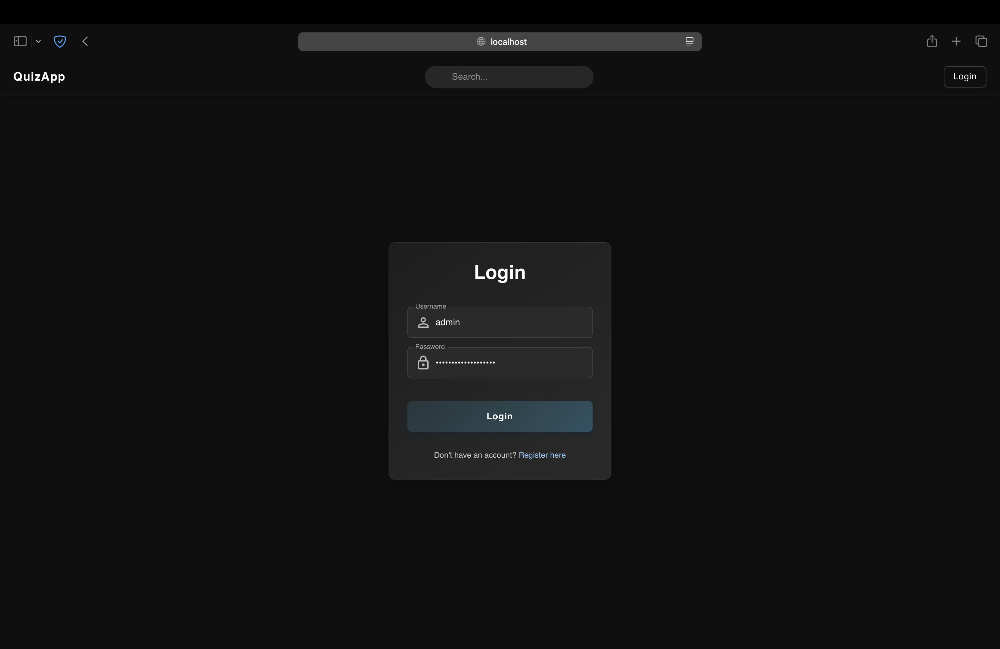
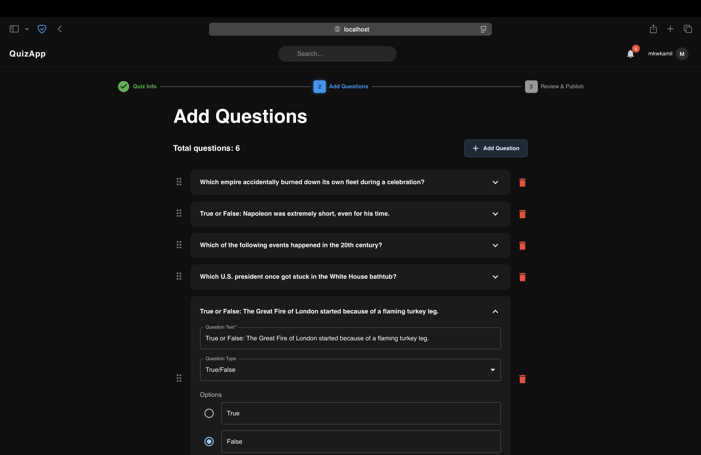

# 📘 Project Overview – QuizApp

This document provides a complete visual and functional overview of the QuizApp platform.  
It walks through the main user-facing views, highlights key features, and explains how users interact with the system.

---

## 🔐 Login & Registration

Users can create an account or sign in securely using JWT-based authentication.

**Key Features:**
- Realtime validation using Yup + React Hook Form
- API error handling with toast notifications
- Redirection to last visited page after login
- Seamless switch between Login and Register forms

---

## 🔍 Explore Quizzes

The main discovery page for browsing all available quizzes.

**Key Features:**
- Dynamic filtering by category, difficulty, rating, length, and answered status
- All filters update the URL in real time (deep-linking support)
- Sorting options: popular, recent, trending, unanswered
- Smooth pagination at the bottom of the page
- Results refresh automatically on filter change (React Query)

---

## 🧠 Quiz Creation – Step 1: Basic Info

Users enter quiz title, description, select category and difficulty, and upload a thumbnail.

**Key Features:**
- Auto-saving draft every 5 seconds
- Draft recovery modal if unsaved progress is detected
- Form validation with inline feedback
- Thumbnail preview with upload support

---

## 🧩 Quiz Creation – Step 2: Add Questions

Users can add any number of questions, each supporting different types.

**Question Types:**
- Single Choice
- Multiple Choice
- True / False

**Key Features:**
- Dynamic question builder
- Inline validation and preview
- Automatic saving to backend

---

## ✅ Quiz Creation – Step 3: Review & Publish

Final step before publishing the quiz.

**Key Features:**
- Preview of all quiz data
- Option to publish or update draft
- Warnings if required fields are missing

---

## 📄 Quiz Overview Page

This is the quiz landing page shown before the quiz starts.  
It gives the user context about the quiz content, allows interaction with the author, and provides access to feedback and social features.

**Key Features:**
- Quiz thumbnail, title, and description displayed prominently
- `Start Quiz` button navigates directly to the first question
- Right sidebar includes:
    - Author card with avatar, public name, and join date
    - Quiz metadata: number of plays, category, difficulty, average score, total questions
    - User ratings bar with real-time rating breakdown
- Comments section:
    - Users can post, like, and reply to comments
    - Comment list auto-updates and supports lazy loading

---

## ▶️ Quiz Gameplay

Users solve the quiz one question at a time with real-time feedback and progress tracking.

**Key Features:**
- One-question-per-screen layout
- Answer saving and validation
- Timer countdown
- Sidebar with quiz metadata

---

## 🧾 Quiz Results

Results page shown after solving a quiz.

**Key Features:**
- Final score display
- Summary of correct/incorrect answers
- Option to rate and comment
- View community feedback

---

## 👤 User Profile

Each user has a public profile with tabs for created quizzes, drafts, liked quizzes, and social connections.

**Key Features:**
- Tabbed layout: My Quizzes, Drafts, Liked, Followers, Following
- Edit profile modal with live update of:
    - Profile picture (upload with preview)
    - Public display name
    - Bio description
- Ability to delete and edit own quizzes or drafts
- Quiz sorting by creation date or title
- Seamless transition to quiz editor with full state preloading

---

## 🖼 Change Profile Picture (Modal)

Users can update their profile picture directly from their profile page using a custom modal with a preview and crop interface.

**Key Features:**
- Avatar upload with real-time preview
- Drag-to-crop and zoom functionality
- Fullscreen overlay modal
- Confirmation and cancel actions
- Automatic update of avatar across the app after saving

---

## 👥 Followers & Following (Modal)

Users can manage their social connections in a dedicated modal accessible from the profile page.

**Key Features:**
- Tabbed interface: view either followers or users being followed
- Each user card shows avatar, public name, and a `Remove` or `Unfollow` button
- Real-time updates after any action (no need to refresh the page)
- Smooth, minimal modal design matching the rest of the UI

