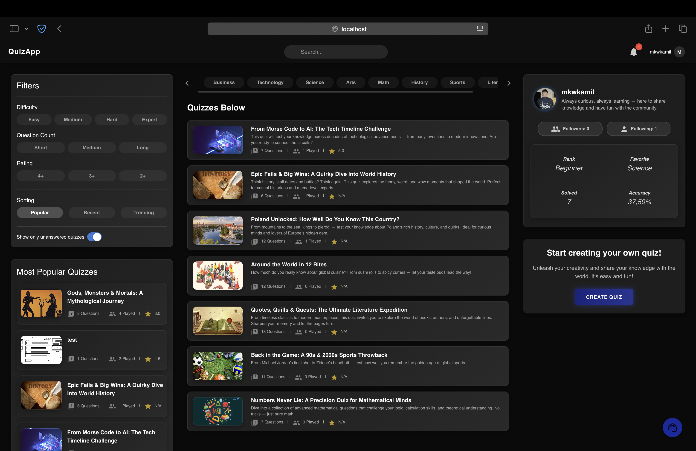
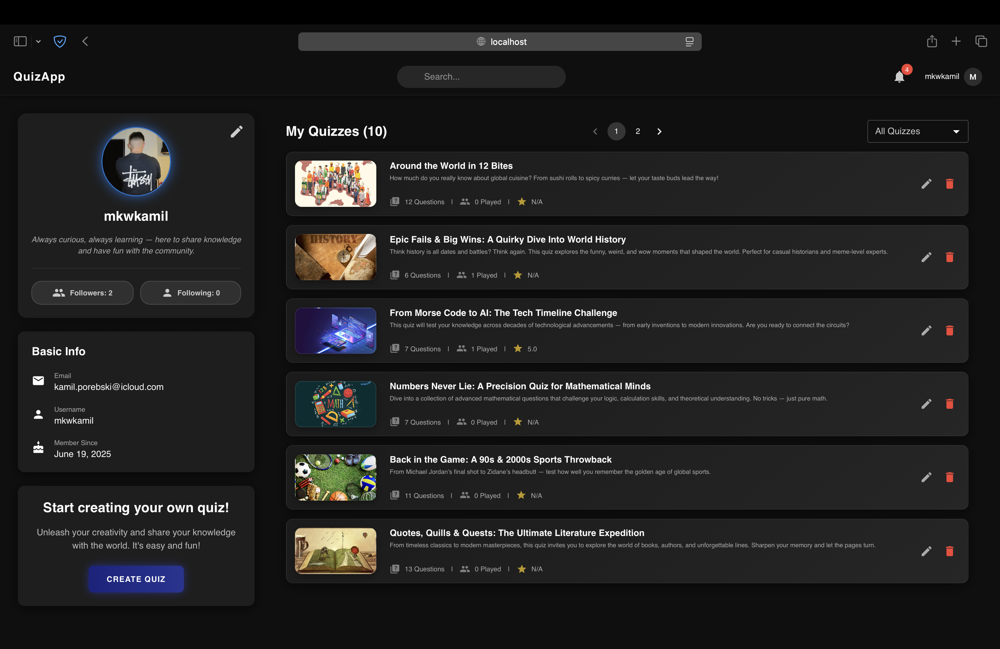
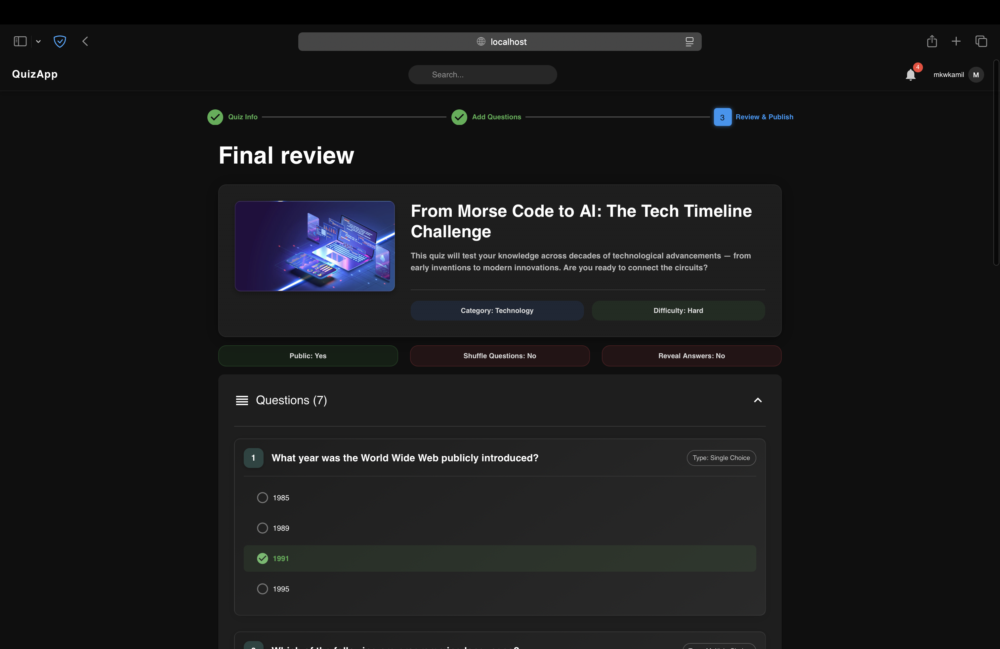
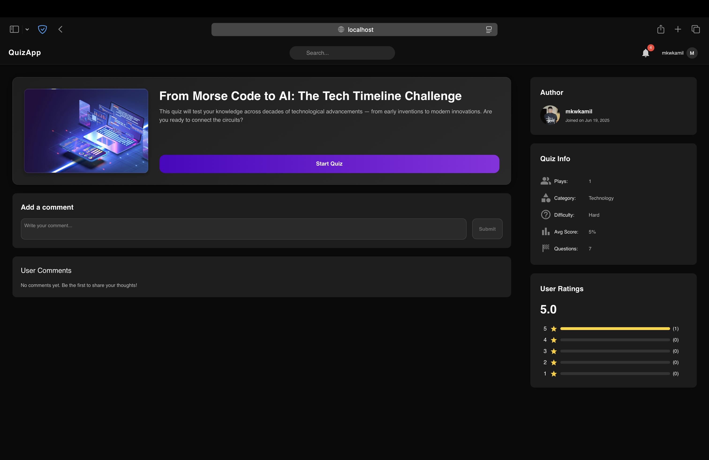

# 🎯 QuizApp

**QuizApp** is a full-stack web application that allows users to create, edit, publish, and play interactive quizzes.  
It combines a modern, responsive frontend with a clean and scalable backend architecture, following best practices for code organization, security, and performance.

The application was built with a strong focus on:
- **User experience** – intuitive navigation, smooth interactions, and a clean UI design.
- **Scalability** – modular architecture, reusable components, and separation of concerns.
- **Security** – JWT-based authentication, role management, and secure data handling.
- **Maintainability** – service-interface pattern, DTO-based communication, and clear code structure.

QuizApp delivers a complete environment for both content creators and players, making it an ideal platform for interactive learning, entertainment, or knowledge testing.

## 📸 Screenshots & Detailed Overview

For a complete visual and functional walkthrough of the application, check the  
**[Project Overview](PROJECT_OVERVIEW.md)** document.

It includes:
- High-quality screenshots of every main page:
    - Login / Register
    - Explore Quizzes
    - Quiz Creation (all steps)
    - Quiz Gameplay
    - Quiz Results
    - User Profile
- Feature highlights for each screen
- Step-by-step explanation of the user flow
- Notes on UI/UX design decisions

**Explore Page Preview**  
  
**Profile Page Preview**
  
**Quiz Creator Review Page**

**Quiz Overview Page**


## 🚀 Features

- **User Authentication & Profiles**  
  Secure login and registration with JWT-based authentication, profile customization, and public/private user details.

- **Quiz Creation & Drafts**  
  Step-by-step quiz editor with automatic draft saving every 5 seconds and the ability to restore previous drafts.

- **Advanced Filtering & Sorting**  
  Browse quizzes by popularity, recency, trends, unanswered status, categories, difficulty, length, and rating.

- **Multiple Question Types**  
  Support for single choice, multiple choice, and true/false questions.

- **Interactive Quiz Gameplay**  
  One-question-at-a-time layout, real-time progress tracking, and countdown timers.

- **Results & Feedback**  
  Detailed results screen with correct/incorrect answer review, quiz ratings, and a comments section.

- **Social Features**  
  Follow/unfollow other users, view followers/following lists, and see quizzes from people you follow.

- **Modern UI/UX**  
  Consistent, responsive design built with Material UI and styled-components, focused on clarity and usability.

## 🛠 Tech Stack

### **Frontend**
- **React + TypeScript** – modern, strongly-typed UI development
- **Zustand** – lightweight and scalable global state management
- **React Query** – efficient data fetching, caching, and synchronization
- **Material UI + styled-components** – modern, customizable UI components with consistent styling
- **Yup + React Hook Form** – form handling with schema-based validation
- **Vite** – fast development and build tool

### **Backend**
- **ASP.NET Core Web API** – high-performance REST API
- **PostgreSQL + Entity Framework Core** – relational database with ORM for migrations and queries
- **JWT Authentication** – secure, token-based authentication
- **Service-Interface Architecture** – clear separation of concerns for maintainability
- **DTO (Data Transfer Objects)** – clean and structured data exchange between client and server

### **Development & Tools**
- Git + GitHub – version control and collaboration
- JetBrains Rider – backend development environment
- VS Code – frontend development environment
- Postman – API testing

## 🏗 Architecture

The application is built as a **full-stack solution** with a clear separation between the frontend and backend, communicating through a REST API.  
The backend follows a **service-interface pattern** to ensure scalability, maintainability, and clean separation of concerns.

[Frontend: React + TypeScript] ⇄ [Backend: ASP.NET Core Web API] ⇄ [Database: PostgreSQL]

### **Backend Structure**
- **Controllers** – Handle incoming HTTP requests and return responses
- **Services** – Contain business logic and interact with repositories
- **Interfaces** – Define contracts for services and repositories
- **DTOs** – Handle structured and safe data transfer between layers
- **Entity Framework Core** – ORM for database interactions and migrations

### **Frontend Structure**
- **Pages/Views** – Main user-facing screens (Explore, Create/Edit, Play, Results, Profile)
- **Components** – Reusable UI building blocks
- **Hooks** – Custom logic for API calls, state handling, and UI behavior
- **Store (Zustand)** – Global state management for persistent UI data
- **Styles** – Consistent UI design with Material UI and styled-components

## ⚙️ Local Setup

Follow these steps to run the project locally.

### **Prerequisites**
Make sure you have installed:
- **Node.js** (v18+)
- **.NET SDK** (v8.0+)
- **PostgreSQL** (v14+)
- **Git**

---

### **1. Clone the repository**
```bash
git clone https://github.com/mkwkamil/quizapp.git
cd quizapp
```

### **2. Backend Setup**
```bash
cd backend
dotnet restore
dotnet ef database update   # Apply database migrations
dotnet run
```

### **3. Frontend Setup**
```bash
cd frontend
npm install
npm run dev
```

Frontend will start at: http://localhost:5173

### **4. Configure Environment Variables**
- Backend: appsettings.Development.json should contain PostgreSQL connection string and JWT settings.
- Frontend: .env file should contain API base URL.

## 📂 Project Structure
``` bash
quizapp/
├── QuizApp.Backend                  # ASP.NET Core Web API
│   ├── Controllers                  # API endpoints
│   ├── Data                         # Database context and configuration
│   ├── DTO                          # Data Transfer Objects
│   ├── Extensions                   # Helpers & middleware extensions
│   ├── Interfaces                   # Service & repository contracts
│   ├── Middleware                   # Custom middleware
│   ├── Migrations                   # EF Core migrations
│   ├── Models                       # Entity models
│   ├── Properties                   # Project properties
│   ├── Services                     # Business logic
│   ├── wwwroot                      # Static files
│   ├── appsettings.json             # Application configuration
│   ├── appsettings.Development.json # Development configuration
│   ├── Program.cs                   # App entry point
│   ├── QuizApp.Backend.csproj       # Project file
│   └── Request.http                 # API testing file
│
├── QuizApp.Frontend                 # React + TypeScript app
│   ├── public                       # Public static files
│   ├── src                          # Application source code
│   │   ├── assets                   # Images, icons, and static assets
│   │   ├── components               # Reusable UI components
│   │   ├── config                   # Configuration files (API, constants)
│   │   ├── hooks                    # Custom React hooks
│   │   ├── interfaces               # TypeScript interfaces & types
│   │   ├── pages                    # Main application views
│   │   ├── schemas                  # Yup validation schemas
│   │   ├── store                    # Zustand global state management
│   │   ├── styles                   # Styled-components & layout styles
│   │   ├── App.tsx                  # Root React component
│   │   └── main.tsx                 # Application entry point
│
├── screens                          # Screenshots for documentation
├── PROJECT_OVERVIEW.md              # Detailed feature & UI overview
└── README.md                        # Project readme
```

## 👤 Author

**Kamil Porębski (mkwkamil)**  
Full-stack developer passionate about building modern, scalable, and user-friendly web applications.  
Specialized in **React + TypeScript** for the frontend and **ASP.NET Core + PostgreSQL** for the backend.

- 📧 Email: [kamil.porebski@icloud.com](mailto:kamil.porebski@icloud.com)
- 🔗 GitHub: [https://github.com/mkwkamil](https://github.com/mkwkamil)
- 💼 LinkedIn: [https://linkedin.com/in/kamilporebski](https://linkedin.com/in/kamilporebski)